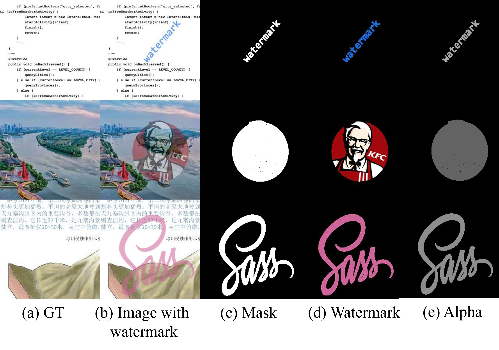

## A Two-Stage Document Image Visible Watermark Removal Model Based on Global and Local Features


Thank you for your attention to our work. Currently, we have publicly released the dataset, pre-trained models, and some code. We will release all code in the future.

感谢您对我们工作的关注，目前我们公开了数据集、预训练模型、以及部分代码，后续将公开所有代码


## 1. Datasets （数据集）

you can download at [Baidu Netdisk](https://pan.baidu.com/s/1Vquf1WdyW28-e_thgjYsXA?pwd=2022 )




## 2. Pretain Model（预训练模型）

you can download at [Baidu Netdisk](https://pan.baidu.com/s/1zzDbuw_pON5K2LB7z-GpJg?pwd=2022)


## 3. Environmental configuration（环境配置）

### 3.1 create Paddle environment

You can refer to  [PaddlePaddle official website](https://www.paddlepaddle.org.cn/install/quick?docurl=/documentation/docs/zh/install/pip/linux-pip.html) for installation

### 3.2 Install necessary tool kit

```shell
pip install -r requirements.txt
```


## 4. How to run scripts? (如何运行？)

```shell
# train
python train_SDIWRD_RWRNet.py
```

```shell
# test
python test.py
```


